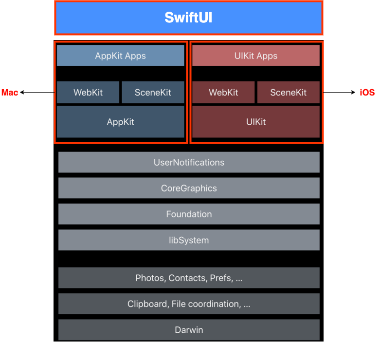
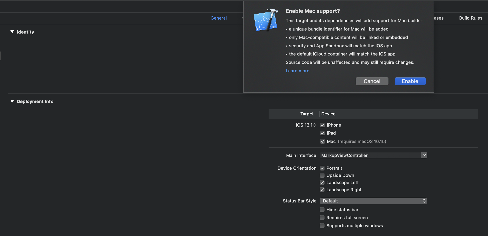
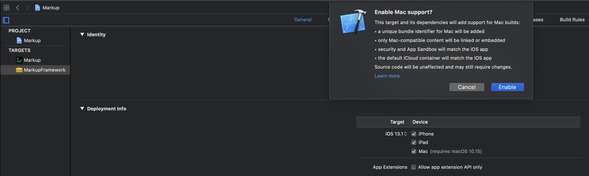
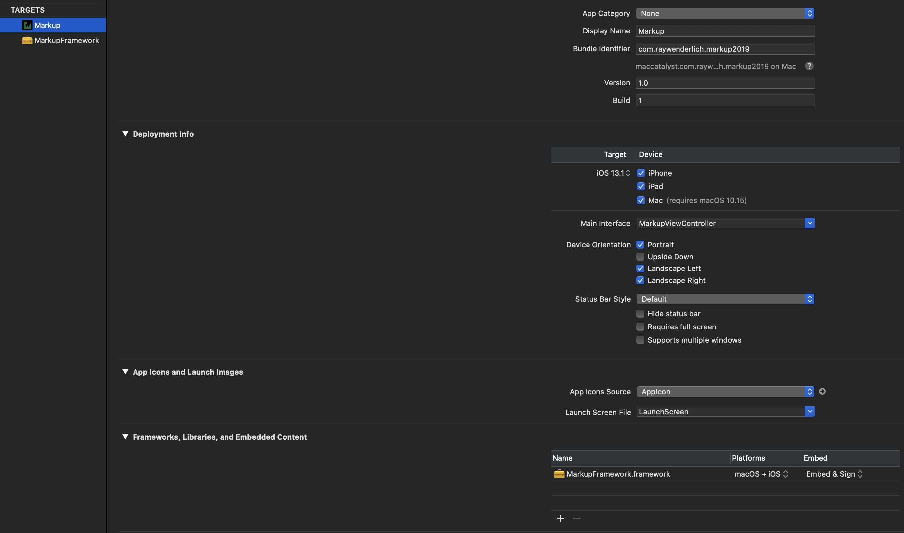
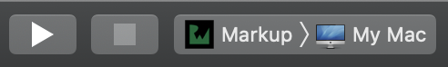
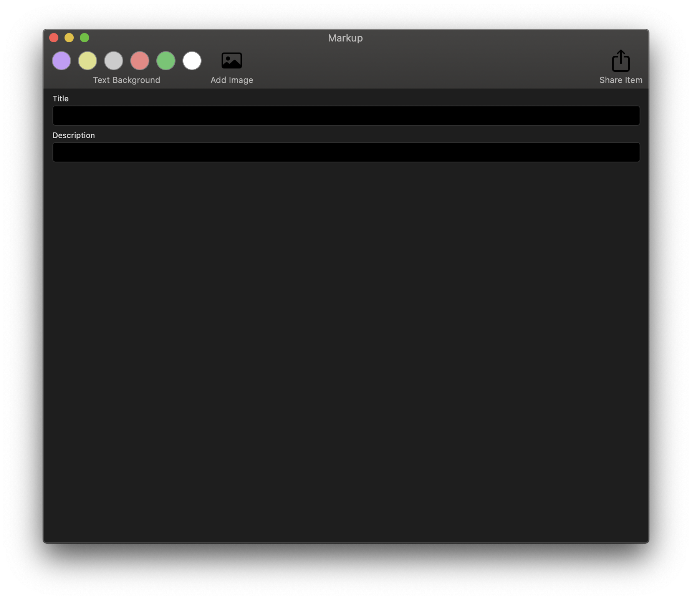

# Catalyst란?

애플은 WWDC 2019에서 아이패드 앱을 맥에서 사용할 수 있게 하는 ‘프로젝트 카탈리스트(Project Catalyst)’를 발표했습니다.

Catalyst를 사용하면 대부분의 UIKit 및 Foundation 코드를 사용하여 macOS에서 기본적으로 실행되는 앱을 컴파일 할 수 있습니다. 

이것이 의미하는 바는

Mac 앱은 AppKit 프레임워크, iOS와 그 기반인 아이패드 OS, 워치 OS, tv OS는 UIKit 프레임워크로 개발합니다.
2015년, 애플은 UXKit을 선보였는데, AppKit이 기반인 프레임워크지만, UIKit을 닮아서 UIKit으로 AppKit 앱을 개발할 수 있게 만든 Mac용 UIKit이라고 할 수 있었습니다.
그러나 애플은 UXKit을 공개하지 않고 있으며, 여전히 AppKit 앱과 UIKit 앱은 나눠진 상태입니다.
그렇기 때문에 프로젝트 카탈리스트는 아이패드 앱을 맥 앱으로 쉽게 전환하는 방법일 뿐이고, 맥과 아이패드의 통합을 얘기할 수는 어렵습니다.
그러나 "완벽하게"는 아니지만 프로젝트 카탈리스트는 주의깊게 봐야할 필요가 있습니다.

이 프로젝트 카탈리스트를 수월하게 만든 게 SwiftUI입니다.
예를 들어, 아이패드 앱에 터치 인터페이스의 로그인 버튼이 있고, 탭 하면 이메일과 비밀번호를 입력하는 로그인 팝업이 나타난다고 가정을 해보겠습니다.
이를 맥 앱으로 전환하려면 엑스코드에서 맥을 지원한다고 체크박스에 표시하기만 하면 됩니다. 하지만 앱은 아이패드에서 사용하는 것처럼 터치 인터페이스에 적합한 형태인 상태입니다.
그래서 로그인 버튼을 메뉴바의 메뉴로 추가하길 원한다면, 메뉴바에 로그인 메뉴를 추가하고, 로그인 버튼의 기능을 메뉴에 드래그 앤 드롭으로 붙여넣기만 하면 됩니다.

이게 얼마나 간단해진 거냐면, 기존에는 아이패드 앱을 같은 시각적 스타일로 AppKit 프레임워크를 사용해서 새로 개발해야 했습니다.
이 과정을 세 단계로 줄였다. 그리고 SwiftUI가 없었다면, 메뉴바에 로그인 메뉴를 추가하고자 아이패드에서 가져온 로그인 버튼의 기능을 맥의 메뉴바에 추가할 수 있도록 수정해야 했습니다.
이마저도 몇 번의 클릭과 드래그 앤 드롭으로 끝납니다.
무엇보다 이러한 개발 속도의 단축이 프로젝트 카탈리스트에만 나타나는 게 아니라 모든 애플 플랫폼에서 이뤄지게 되었다는 것 입니다.


#  Ccatlyst tutorial

본 튜토리얼에서는 iOS 앱을 훌륭한 macOS 앱을 만들기 위해 처리해야하는 좀 더 복잡한 사례를 다룹니다.
우선은 [프로젝트](https://github.com/kiryun/Catalyst_tutorial/tree/175e6b468f352b892d752b1134b060e03c24b700) 를 다운로드 받는 것부터 시작입니다.

본 프로젝트는 iOS에서 실행되는 App이며 이를 Mac에서도 실행이 가능하도록 해보겠습니다.

## Mac용 빌드 활성화

1. PROJECT > "MarkUp" > General > Deployment Info > Mac 을 선택하면 Mac 지원을 활성화 할 것인지 묻는 대화 상자가 나타납니다. 
   Enable을 클릭하겠습니다.

   

   

2. 다음으로, 프레임 워크에서 비슷한 설정을해야합니다. 

   TARGETS > "MarkupFramework" > Deployment Info > Mac 을 선택하면 됩니다.

   

   

3. TARGES > "MarkUp" > Frameworks, Libraries, and Embedded Content 에서 "MarkupFramework.framework"를 추가합니다. 옵션은 macOS + iOS를 선택합니다.

   

   이러한 동작은 프로젝트를 macOS 용으로 컴파일하도록 설정합니다. Xcode는 원래 iOS 번들 ID를 기반으로 Mac 빌드 용 새 번들 ID를 자동으로 생성합니다. 이 프로젝트에는 maccatalyst.com.raywenderlich.markup2019가 표시됩니다.

   Mac 용 번들 ID를 수동으로 할당 할 수 있습니다. iTunes Connect에서이 작업을 수행 할 수 있지만이 튜토리얼에서는 자동으로 할당 된 ID를 사용하겠습니다.

   

4. 이제 Run target을 My으로 설정한 뒤 실행하겠습니다.

   

   실행을 하면 이전에 iOS , iPadOS에서 보던 UI가 그대로 실행되는 것을 볼 수 있습니다.

   

## 조건부 컴파일

macOS와 iOS에서 각각 실행해야할 코드가 서로 다르다면 조건부 컴파일을 사용할 수 있습니다.
Xcode는 코드를 두 번 컴파일합니다. 한 번은 iOS와 한 번은 macOS입니다. 
이러한 기능을 구현하기 위해 다음 코드를 사용할 수 있습니다.

```swift
#if targetEnvironment(macCatalyst)
  //code to run on macOS 
#else
  //code to run on iOS
#endif
```


# References

* https://www.raywenderlich.com/5037284-catalyst-tutorial-running-ipad-apps-on-macos
* https://medium.com/맥갤러리/애플이-말한-플랫폼-통합과-스위프트-ui의-의미-b0c4c970380d
* https://post.naver.com/viewer/postView.nhn?volumeNo=21215853&memberNo=6384148